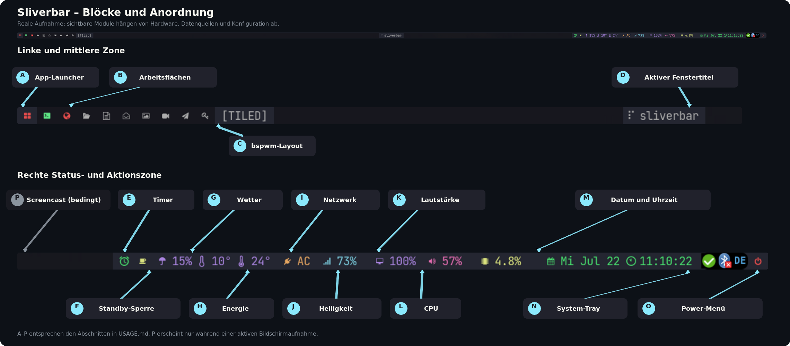

# Sliverbar: Funktionen und Bedienung

Sliverbar ist ein leichtgewichtiges, natives X11-Panel und spielt damit in
derselben Kategorie wie Polybar und Lemonbar. Gegenüber einer typischen
Polybar-Konfiguration verfolgt Sliverbar einen bewusst kompakteren Ansatz:
eine einfache `key=value`-Datei steuert die vorhandenen Module, Farben,
Anwendungsrollen und Backends. Gegenüber Lemonbar, das in erster Linie eine
leistungsfähige Darstellungs- und Klickfläche bereitstellt, bringt Sliverbar
die Datenerfassung, Zustandsverwaltung, Mausaktionen, Popups und das
System-Tray bereits als zusammenhängende Anwendung mit.

Der funktionale Schwerpunkt liegt derzeit auf **bspwm**. Dort kann Sliverbar
den nativen `bspc subscribe report`-Datenstrom auswerten, Arbeitsflächen
schalten und das aktuelle Layout anzeigen. Eine generische Basis ist bereits
vorhanden: Unter anderen EWMH-kompatiblen X11-Window-Managern kann Sliverbar
Arbeitsflächen und Fenstertitel über standardisierte X11-Eigenschaften
ermitteln. Diese Variante besitzt aber noch nicht in allen Bereichen dieselbe
Integration und Testtiefe wie bspwm. Eine künftig breiter ausgerichtete
Version kann auf diesem EWMH-Backend aufbauen.

## Die Leiste im Überblick



Die Abbildung zeigt eine reale Sliverbar-Instanz. Welche Blöcke tatsächlich
sichtbar sind, hängt von `module_NAME`, der Hardware und den verfügbaren
Datenquellen ab. Beispielsweise erscheint der Screencast-Indikator nur während
einer Aufnahme, auf einem Desktop ohne Akku wird `AC` angezeigt und Wetter
bleibt ohne konfigurierten Ort verborgen.

Sliverbar teilt die Panelbreite in drei Zonen:

- links: App-Launcher, Arbeitsflächen und bspwm-Layout;
- mittig: Titel des aktiven Fensters;
- rechts: Status-, Steuer-, Tray- und Power-Blöcke.

## Mausbelegung

In dieser Anleitung bedeuten:

| Bezeichnung | Eingabe |
| --- | --- |
| Linksklick | Maustaste 1 |
| Mittelklick | Maustaste 2 |
| Rechtsklick | Maustaste 3 |
| Mausrad hoch | Maustaste 4 |
| Mausrad herunter | Maustaste 5 |

Nicht jeder Block besitzt eine Aktion. Reine Anzeigen reagieren bewusst nicht
auf Mausklicks.

## Linke und mittlere Zone

### A – App-Launcher

Der linke Block öffnet den Anwendungsstarter. Das Verhalten wird mit
`application_launcher=auto|internal|external|disabled` ausgewählt.

- `auto` bevorzugt den eingebauten Starter und verwendet andernfalls den mit
  `launcher=` konfigurierten externen Starter.
- `internal` zeigt ausschließlich den nativen Starter.
- `external` startet ausschließlich die konfigurierte Desktop-Datei oder
  argv-basierte Anwendung.
- `disabled` deaktiviert die Funktion unabhängig von `module_launcher`.

Der interne Starter liest den Desktop-Anwendungskatalog über GIO neu ein,
beachtet Menü-Sichtbarkeit und startet nur registrierte Desktop-IDs. Die Suche
arbeitet Unicode-bewusst und priorisiert Namens- und Wortanfänge. Bedienbar
ist das Popup mit Tastatureingabe, Pfeiltasten, Bild hoch/herunter,
Pos1/Ende, Eingabetaste, Escape und Rücktaste sowie per Linksklick und
Mausrad.

**Mausaktion:** Linksklick öffnet oder schließt den Starter.

### B – Arbeitsflächen

Der Arbeitsflächenblock zeigt die Desktops des ausgewählten
Workspace-Backends. Unter bspwm stammen Namen und Zustände aus dem persistenten
Report-Stream. Sliverbar unterscheidet unter anderem:

- freie und belegte Arbeitsflächen;
- die fokussierte Arbeitsfläche;
- dringende Arbeitsflächen;
- fokussiert und gleichzeitig belegt oder dringend.

Die Darstellung verwendet dafür die konfigurierten Vorder- und
Hintergrundfarben. In der abgebildeten bspwm-Konfiguration werden die
Arbeitsflächen 1 bis 9 als Symbole dargestellt.

**Mausaktion:** Linksklick fokussiert die ausgewählte Arbeitsfläche über das
aktive Backend.

### C – bspwm-Layout

Am Ende des bspwm-Workspace-Reports zeigt Sliverbar den Layoutzustand der
fokussierten Arbeitsfläche:

- `[TILED]` für gekachelte Fenster;
- `[MONOCLE]` für das Monocle-Layout;
- `[UNKNOWN]`, wenn kein bekannter Layoutwert vorliegt.

Dieser Zusatz ist eine bspwm-spezifische Erweiterung. Das generische
EWMH-Backend besitzt keine standardisierte Eigenschaft für das bspwm-Layout.

**Mausaktion:** keine.

### D – Aktiver Fenstertitel

Der mittlere Block zeigt den Titel des aktuell aktiven X11-Fensters. Im
nativen Build überwacht Sliverbar `_NET_ACTIVE_WINDOW` und `_NET_WM_NAME`
ereignisbasiert über XCB; es ist kein dauerndes `xprop`-Polling nötig.
`title_max` begrenzt die angezeigte Länge.

**Mausaktion:** keine.

## Rechte Status- und Aktionszone

Die Reihenfolge ist fest definiert. Deaktivierte oder im `auto`-Modus nicht
verfügbare Module belegen keinen Platz.

### P – Screencast-Indikator

Der Screencast-Block erscheint im Standardmodus nur, wenn unter
`$XDG_RUNTIME_DIR/screencast.pid` eine Aufnahmemarkierung existiert. Damit kann
ein externes Aufnahme-Skript Sliverbar ohne zusätzliche IPC über eine laufende
Bildschirmaufnahme informieren. Ein aktiver Screencast wird in der kritischen
Farbe dargestellt.

**Mausaktion:** keine.

### E – Timer

Der integrierte Timer benötigt kein externes Timerprogramm.

| Zustand | Anzeige |
| --- | --- |
| leer | grünes Standardsymbol |
| eingestellt | rote Minutenangabe und Symbol für einen gestellten Timer |
| laufend | rote Minutenangabe und achtteilige Animation |
| pausiert | rote Minutenangabe und Pausensymbol |
| regulär abgelaufen | Ablaufsymbol während der Tonwiedergabe beziehungsweise kurz bei nicht startbarem Ton |
| manuell zurückgesetzt | Rücksetzsymbol für 1,5 Sekunden |

Die acht Animationsphasen wechseln alle 125 Millisekunden und ergeben einen
Umlauf pro Sekunde. Beim ersten Start und nach jedem Fortsetzen beginnt die
Animation wieder mit Phase 1. Verzögert sich die Ereignisschleife, berechnet
Sliverbar den korrekten Frame aus monotoner Zeit, statt veraltete Frames
nachzuspielen.

**Mausaktionen:**

- Mausrad hoch: vor dem ersten Start eine Minute addieren;
- Mausrad herunter: vor dem ersten Start eine Minute abziehen, nie unter null;
- Linksklick: starten, pausieren oder fortsetzen;
- Rechtsklick: einen eingestellten, laufenden oder pausierten Timer lautlos
  zurücksetzen.

Nach regulärem Ablauf sendet Sliverbar nach Möglichkeit eine
Desktop-Benachrichtigung und spielt `timer_sound` über das erste verfügbare
Backend aus `pw-play`, `paplay`, `canberra-gtk-play` oder `aplay`. Fehler bei
Ton oder Benachrichtigung beeinträchtigen weder Panel noch Timerzustand.

### F – Standby- und Hibernation-Sperre

Der Kaffeetassenblock schaltet eine echte
`systemd-inhibit --what=sleep`-Sperre. Sie verhindert automatischen Standby und
Hibernation, solange sie aktiv ist. Inaktiv verwendet der Block
`color_free`, aktiv `color_warning`. Eine Desktop-Benachrichtigung bestätigt
den neuen Zustand.

Der Block wird im `auto`-Modus verborgen, wenn `systemd-inhibit` fehlt. Sein
Zustand wird nach einem Sliverbar-Neustart nicht automatisch wiederhergestellt.

**Mausaktion:** Linksklick schaltet die Sperre ein oder aus.

### G – Wetter

Das Wettermodul lädt über `curl` JSON-Daten von `wttr.in` und zeigt:

- die höchste Regenwahrscheinlichkeit der nächsten Zeitabschnitte;
- minimale Temperatur;
- maximale Temperatur.

Bis zu vier Orte lassen sich mit
`weather_location=safe-id|Anzeigename|Suchwert` konfigurieren. Der aktive Ort
wird unter `$XDG_STATE_HOME/sliverbar` gespeichert; die JSON-Caches liegen
unter `$XDG_CACHE_HOME/sliverbar/weather`. Beim Umschalten erscheint zuerst ein
vorhandener Cache, danach wird asynchron aktualisiert.

`weather_interval` ist auf 1800 bis 14400 Sekunden, also 30 bis 240 Minuten,
begrenzt. Werte außerhalb des Bereichs werden auf die nächste Grenze gesetzt
und als Warnung protokolliert.

**Mausaktionen:**

- Linksklick: bei mehreren Orten die Ortsauswahl öffnen;
- Mittelklick: sofort aktualisieren;
- Rechtsklick: die native Drei-Tage-Vorschau öffnen oder schließen.

Die Vorschau erscheint direkt unter dem Wetterblock. Für heute und die beiden
folgenden Tage zeigt sie die Tiefst- und Höchsttemperatur sowie Vorhersagen für
06, 09, 12, 15, 18 und 21 Uhr. Jede Zeitspalte enthält ein mit Cairo
gezeichnetes Zeitfeld, eine Wetter-Glyphe, die Temperatur und die
Regenwahrscheinlichkeit. Fehlende Werte erscheinen als Gedankenstrich; ohne
verfügbare Icon-Schrift nutzt Sliverbar monochrome Unicode-Symbole.

In der Kopfzeile steht links der aktive Ort und rechts der Zeitpunkt der
letzten erfolgreichen Cache-Aktualisierung. Für Daten vom aktuellen Tag wird
`Aktualisiert HH:MM` angezeigt, bei älteren Daten zusätzlich das Datum. Ohne
verwertbaren Cache erscheint `Aktualisiert –`.

Die Ansicht verwendet ausschließlich den vorhandenen JSON-Cache und wird nach
einer asynchronen Aktualisierung einschließlich des Zeitpunkts neu gezeichnet.
Sliverbar lädt kein Vorhersage-PNG mehr herunter und startet keinen externen
Bildbetrachter. Der alte Schlüssel `weather_image=` wird noch akzeptiert, aber
ignoriert und als veraltet protokolliert.

Ohne konfigurierten Ort oder ohne verwertbare Daten bleibt der Block im
`auto`-Modus verborgen.

### H – Energieversorgung und Akku

Sliverbar liest Akkus unter `/sys/class/power_supply`, mittelt bei mehreren
Akkus deren Ladestand und zeigt ein zur Kapazität passendes Symbol. Laden,
voller Akku, Warnschwelle und kritische Schwelle werden farblich
unterschieden. Ist eine Stromversorgung vorhanden, aber kein Akku, erscheint
wie in der Abbildung `AC`.

**Mausaktion:** keine.

### I – Netzwerk

Der Netzwerkblock erkennt aktive kabelgebundene und drahtlose Interfaces unter
`/sys/class/net`. Für WLAN wird bevorzugt die Kernel-Linkqualität des aktiven,
möglichst für die Standardroute verwendeten Interfaces aus
`/proc/net/wireless` genutzt. Liefert der Treiber keinen brauchbaren Wert,
dient NetworkManager über `nmcli` als Fallback. SSID und
Verbindungsänderungen können ebenfalls über NetworkManager bezogen werden.

**Mausaktionen:**

- Linksklick: die automatisch erkannte oder mit `network_settings=`
  konfigurierte Netzwerkeinstellung öffnen;
- Rechtsklick: die aktuelle SSID als Benachrichtigung anzeigen.

### J – Helligkeit

Der Helligkeitsblock liest den aktuell verbundenen Ausgang und dessen
`Brightness`-Wert mit `xrandr`. Änderungen erfolgen in
`brightness_step`-Schritten, sind auf 5 bis 100 Prozent begrenzt und werden
kurz entprellt, damit schnelle Mausradbewegungen nicht für jeden Tick einen
separaten Prozess starten.

**Mausaktionen:** Mausrad hoch erhöht, Mausrad herunter verringert die
Helligkeit.

Wichtig: `xrandr --brightness` verändert die Ausgabe softwareseitig. Es ist
nicht dasselbe wie die Hardware-Hintergrundbeleuchtung eines Notebook-Panels.

### K – Lautstärke

Sliverbar verwendet bevorzugt `pactl` für den Standard-Ausgang und fällt auf
`amixer Master` zurück. Angezeigt werden Lautstärke und Stummschaltung.
`volume_step` legt die Schrittweite fest.

**Mausaktionen:**

- Linksklick: die erkannte oder mit `volume_settings=` konfigurierte
  Lautstärkeeinstellung öffnen;
- Rechtsklick: stumm beziehungsweise laut schalten;
- Mausrad hoch/herunter: Lautstärke erhöhen oder verringern.

### L – CPU

Der CPU-Block berechnet aus zwei aufeinanderfolgenden Messungen in
`/proc/stat` die prozentuale Gesamtauslastung. Er wird regelmäßig aktualisiert,
ohne ein externes Monitoringprogramm für die Anzeige zu benötigen.

**Mausaktion:** Linksklick öffnet den erkannten oder mit `system_monitor=`
konfigurierten Systemmonitor.

### M – Datum und Uhrzeit

Der Uhrblock zeigt Kalenderdatum, eine zur lokalen Stunde passende Uhrglyphe
und die Uhrzeit mit Sekunden. Sprache und Abkürzungen folgen
`language=auto|de|en`. Bei `auto` wird Deutsch nur für eine deutsche
Systemsprache gewählt, andernfalls Englisch.

Die Uhrglyphe wechselt stündlich. Mit leerem `icon_font` verwendet Sliverbar
einen darstellbaren Unicode-Fallback.

**Mausaktionen:**

- Linksklick öffnet die erkannte oder mit `calendar=` konfigurierte
  Kalenderanwendung.
- Rechtsklick öffnet oder schließt bei `agenda_provider=eds` die native,
  ausschließlich lesende Agenda direkt und ohne Abstand an der
  Panelunterkante.

Die Agenda liest Termine und Aufgaben aus den bereits in Evolution Data Server
aktivierten Quellen. Sliverbar synchronisiert weder selbst über CalDAV noch
verwaltet es OAuth oder Zugangsdaten; interne Datenbanken von Evolution und
Thunderbird werden nicht gelesen. Verfügbare sichere Quellenkennungen zeigt:

```sh
sliverbar --list-pim-sources
```

Alle aktivierten Quellen, keine Quelle eines Typs oder bis zu 16 explizite
Quellen werden so ausgewählt:

```ini
agenda_provider=eds
agenda_calendar_source=*
agenda_task_source=*
# agenda_calendar_source=stable-source-id
# agenda_task_source=none
```

`agenda_provider=none` ist der portable Standard. Die Anzeige umfasst
standardmäßig 7 lokale Kalendertage und höchstens 10 Zeilen, davon maximal 2
undatierte Aufgaben. `agenda_days` erlaubt 1–31, `agenda_max_items` 4–20,
`agenda_max_undated_tasks` 0–5, `agenda_refresh_interval` 60–3600 Sekunden und
`agenda_popup_width` 320–720 Pixel. Werte außerhalb dieser Grenzen werden mit
Warnung begrenzt. `agenda_show_source=true|false` schaltet Quellennamen um.

Termine verwenden `agenda_event_color=#8BE9FD`, Aufgaben
`agenda_task_color=#FFB86C`, überfällige Aufgaben
`agenda_overdue_color=#FF5555` und Quellen
`agenda_source_color=#6272A4`. Ein Klick auf eine Terminzeile öffnet
`calendar=auto`, ein Klick auf eine Aufgabenzeile `tasks=auto`; beide Rollen
akzeptieren auch `desktop:ID.desktop` und `command:PROGRAM ARGUMENTS` ohne
Shell-Auswertung.

EDS wird asynchron initialisiert. Bis mindestens eine Quelle erreichbar ist,
hat der Rechtsklick keine Wirkung. Bei Teilausfällen bleiben erreichbare
Quellen sichtbar; bei Gesamtausfall wird der Zustand protokolliert und kein
Popup geöffnet. Es entsteht kein Agenda-Cache auf der Festplatte.

### N – System-Tray

Sliverbar besitzt einen nativen XEmbed-System-Tray und übernimmt die
`_NET_SYSTEM_TRAY_Sn`-Auswahl des verwendeten X-Screens. Tray-Clients werden in
ein eigenes Hostfenster eingebettet; dessen gemessene Breite wird beim Rendern
reserviert. Ein zusätzliches `trayer` ist nicht erforderlich und sollte nicht
parallel laufen.

**Mausaktionen:** hängen von der jeweils eingebetteten Tray-Anwendung ab.

### O – Power-Menü

`power_menu_mode=auto|internal|external|disabled` steuert den rechten
Power-Block. Das interne Menü fragt die Fähigkeiten von
`org.freedesktop.login1.Manager` ab und zeigt nur verfügbare Aktionen aus:

- Sperren;
- Standby;
- Hibernation;
- Suspend-then-hibernate;
- Hybrid sleep;
- Neustart;
- Ausschalten.

`power_actions` bestimmt die erlaubte und sortierte Teilmenge,
`power_confirm` die bestätigungspflichtigen Aktionen. Sperren wird nur
angeboten, wenn ein bekannter ScreenSaver-Dienst registriert ist. Eine
allgemeine Logout-Aktion wird nicht geraten, weil sie vom jeweiligen Desktop
oder Window-Manager abhängt.

Wenn die Standby-Sperre aktiv ist, löst eine bestätigte Schlafaktion sie vor
dem Aufruf. Schlägt die Aktion fehl, stellt Sliverbar die Sperre wieder her.

**Mausaktion:** Linksklick öffnet oder schließt das Power-Menü.

## Zusammenspiel von Sliverbar, bspwm und sxhkd

Die drei Programme haben klar getrennte Aufgaben:

| Komponente | Aufgabe |
| --- | --- |
| bspwm | verwaltet Monitore, Arbeitsflächen, Fenster, Fokus und Layout |
| sxhkd | bindet Tastenkombinationen an Befehle, meistens `bspc` |
| Sliverbar | visualisiert Zustände, verarbeitet Panel-Mausaktionen und stellt Launcher, Tray sowie Popups bereit |

Der normale Informationsfluss sieht so aus:

```text
Tastatur ──> sxhkd ──> bspc ──> bspwm
                                  │
                                  └── bspc subscribe report ──> Sliverbar

Maus auf Sliverbar ──> interne Aktion ──> bspc / pactl / xrandr / Anwendung
```

Ein Beispiel: `Super+3` wird von sxhkd erkannt und führt
`bspc desktop -f focused:^3` aus. bspwm wechselt den Desktop und veröffentlicht
unmittelbar einen neuen Report. Sliverbar liest diesen Report aus seinem
bereits laufenden `bspc subscribe report`-Prozess und zeichnet den
Arbeitsflächenblock neu. sxhkd kommuniziert dabei nicht direkt mit Sliverbar.

Umgekehrt sendet ein Linksklick auf eine Arbeitsfläche die Auswahl über
Sliverbars internes Aktionsprotokoll an das Workspace-Backend. Das
bspwm-Backend ruft `bspc desktop -f ...` ohne Shellauswertung auf; der folgende
bspwm-Report bestätigt den neuen Zustand.

### Erforderliche bspwm-Rahmenbedingungen

bspwm sollte am oberen Rand Platz in Höhe der Leiste reservieren. Bei der
Standardhöhe von 25 Pixeln:

```sh
bspc config top_padding 25
```

Sliverbar setzt außerdem einen EWMH-Docktyp und eine Strut. Das explizite
`top_padding` bleibt in einer bspwm-Konfiguration sinnvoll, besonders wenn die
Leiste per Tastenkürzel verborgen wird.

Die Sitzung kann Sliverbar beispielsweise aus dem bspwm-Autostart starten:

```sh
sliverbar --config "$HOME/.config/sliverbar/panel.conf"
```

Sliverbar besitzt eine Laufzeitsperre und verhindert damit eine zweite
gleichzeitige Instanz für denselben X-Screen.

### Sinnvolle sxhkd-Bindings

Arbeitsflächen lassen sich wie üblich direkt über bspwm steuern:

```sxhkd
super + {_,shift + }{1-9}
    bspc {desktop -f,node -d} focused:'^{1-9}'
```

Sliverbar aktualisiert sich danach über den bspwm-Report automatisch.

Ein optionales Ein-/Ausblenden kann gleichzeitig den bspwm-Abstand anpassen:

```sxhkd
super + b
    {xdo hide -a sliverbar; bspc config top_padding 0 ,\
     xdo show -a sliverbar; bspc config top_padding 25 }
```

Dieses Beispiel benötigt `xdo`. Die Tastenkombination ist keine interne
Sliverbar-Funktion; sxhkd führt die beiden Zustandswechsel aus. Das native
Trayfenster folgt der Sichtbarkeit der Leiste.

Lautstärke- und Helligkeitstasten können weiterhin über sxhkd verwaltet werden.
Die Mausradaktionen in Sliverbar sind davon unabhängig und verwenden ihre
eigenen Backends. Werden Werte extern geändert, übernimmt Sliverbar sie bei der
nächsten Aktualisierung beziehungsweise beim passenden Ereignis.

## Generisches EWMH-Backend

`workspace_backend=auto` bevorzugt bspwm, wenn ein erreichbares `bspc`
vorhanden ist, und verwendet ansonsten EWMH. Weitere Möglichkeiten sind:

| Wert | Verhalten |
| --- | --- |
| `auto` | bspwm bevorzugen, sonst EWMH |
| `bspwm` | bspwm anfordern, bei Ausfall auf EWMH zurückfallen |
| `ewmh` | ausschließlich das generische EWMH-Backend verwenden |
| `none` | Arbeitsflächenblock ausblenden |

Das EWMH-Backend verwendet insbesondere `_NET_NUMBER_OF_DESKTOPS`,
`_NET_CURRENT_DESKTOP`, `_NET_DESKTOP_NAMES`, `_NET_CLIENT_LIST`,
`_NET_WM_DESKTOP` und Dringlichkeitszustände. Der Fenstertitel folgt
`_NET_ACTIVE_WINDOW` und `_NET_WM_NAME`.

Unter einem EWMH-kompatiblen Window-Manager funktionieren damit die
grundlegenden Arbeitsflächen und unabhängigen Module. WM-spezifische Details
wie das bspwm-Layout können fehlen; bei nicht EWMH-kompatiblen Window-Managern
bleibt der Betrieb ohne Workspace-Block möglich.

## Konfiguration

Sliverbar verwendet eine einfache `key=value`-Datei. Ohne explizite Angabe
wird in dieser Reihenfolge gesucht:

1. `$XDG_CONFIG_HOME/sliverbar/panel.conf`;
2. `$HOME/.config/sliverbar/panel.conf`;
3. systemweit installierte Konfiguration;
4. lokale Entwicklungskonfiguration.

Eine Datei kann auch direkt ausgewählt werden:

```sh
sliverbar --config /pfad/zu/panel.conf
```

Jedes Hauptmodul besitzt einen Schalter
`module_NAME=auto|enabled|disabled`:

- `auto` zeigt den Block nur, wenn seine Datenquelle oder sein Backend
  verfügbar ist;
- `enabled` fordert den Block an, soweit seine zwingenden Voraussetzungen
  erfüllt sind;
- `disabled` entfernt ihn vollständig.

Unterstützt werden `clock`, `title`, `cpu`, `battery`, `screencast`, `volume`,
`network`, `brightness`, `weather`, `timer`, `inhibitor`, `launcher`, `tray`
und `power`.

### Anwendungsrollen

`system_monitor`, `network_settings`, `volume_settings` und `calendar` stehen
standardmäßig auf `auto`. Explizite Werte können folgende Formen verwenden:

```ini
system_monitor=desktop:org.gnome.SystemMonitor.desktop
network_settings=command:nm-connection-editor
volume_settings=terminal:pulsemixer
```

Sliverbar zerlegt diese Werte in geprüfte Argumentlisten und wertet keine
Shellsyntax aus. Desktop-Dateien und Standard-Dateihandler werden über GIO
gestartet. Terminalprogramme verwenden bevorzugt `xdg-terminal-exec`, danach
`$TERMINAL` oder erkannte Terminalemulatoren mit ihrem passenden
Ausführungsschalter.

### Sprache, Schriften und Farben

- `language=auto|de|en` steuert Datumsabkürzungen, Wetter, Popups und
  Benachrichtigungen.
- `font` ist die normale Pango-Schrift.
- `icon_font` ist optional; ohne sie verwendet Sliverbar darstellbare
  Fallbacks und vorhandene Pango-Fallback-Schriften.
- `color_*` konfiguriert Panelhintergrund, Workspace-Zustände und die
  Modulfarben.
- `height` setzt die Panelhöhe, `monitor` wählt primären Monitor, Namen,
  RandR-Index oder `all`.

Sliverbar passt Fenster, Strut, Tray und Popupgrenzen bei einer geänderten
RandR-Anordnung neu an.

## Optionale Programme und reduzierte Funktion

Fehlende Hilfsprogramme beenden Sliverbar nicht. Im `auto`-Modus wird nur das
betroffene Modul verborgen oder eingeschränkt.

| Programm oder Dienst | Verwendung |
| --- | --- |
| `bspc` | erweitertes bspwm-Workspace-Backend |
| `pactl` oder `amixer` | Lautstärke lesen und ändern |
| `xrandr` | Helligkeit lesen und ändern |
| `nmcli` | SSID, WLAN-Fallback und Netzwerkereignisse |
| `curl` | Wetterdaten im JSON-Format |
| `notify-send` | Timer-, Inhibitor- und Statusbenachrichtigungen |
| `systemd-inhibit` | Standby- und Hibernation-Sperre |
| `pw-play`, `paplay`, `canberra-gtk-play` oder `aplay` | Timerklang |
| GIO und `shared-mime-info` | Desktop-Anwendungen und Standard-Dateihandler |
| logind über D-Bus | internes Power-Menü |

## Diagnose und sichere Inbetriebnahme

Vor dem Start lässt sich die Konfiguration prüfen:

```sh
sliverbar --config "$HOME/.config/sliverbar/panel.conf" --check-config
```

Eine erfolgreiche Prüfung beendet sich mit Status 0. Unbekannte oder
ungültige Schlüssel werden nicht stillschweigend ignoriert.

Die Laufzeitdiagnose startet kein Panel, sondern meldet unter anderem
Konfigurationspfad, Display, Workspace-Backend, Schriften, optionale Programme,
Anwendungsrollen, WLAN-Quelle, Wetterorte, Power-Fähigkeiten und
Inhibitor-Backend:

```sh
sliverbar --config "$HOME/.config/sliverbar/panel.conf" --diagnose
```

Die installierte Version wird mit folgendem Befehl ausgegeben:

```sh
sliverbar --version
```

## Technische Eigenschaften

Neben den sichtbaren Blöcken besitzt Sliverbar folgende übergreifende
Eigenschaften:

- native X11-Dock- und Strut-Verwaltung über XCB;
- Cairo-/Pango-Rendering mit gemessenen linken, mittleren und rechten Zonen;
- eine zentrale `poll(2)`-Ereignisschleife statt vieler dauernd laufender
  Modulskripte;
- `timerfd` und monotone Zeit für periodische und kurzzeitige Zustände;
- `signalfd` für kontrolliertes Beenden und Aufräumen;
- natives XEmbed-System-Tray;
- interne, tastaturbedienbare Launcher- und Power-Popups;
- Multi-Monitor- und Multi-X-Screen-Unterstützung über RandR;
- asynchrone Wetteraktualisierung mit atomisch veröffentlichten Caches;
- optionale Programme werden mit expliziten argv-Listen und ohne
  Shellauswertung gestartet;
- ein CLI-only-Build bleibt ohne XCB-Entwicklungsheader für
  `--check-config`, `--diagnose` und `--version` baubar.

Damit ist Sliverbar nicht nur eine formatierte Statuszeile, sondern ein
eigenständiges Panel mit Anzeige, Eingabe, Zustandsverwaltung, Popups,
Workspace-Integration und System-Tray.
